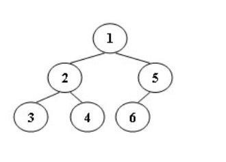

# 题目1 树的遍历
An inorder binary tree traversal can be implemented in a non-recursive way with a stack. For example, suppose that when a 6-node binary tree (with the keys numbered from 1 to 6) is traversed, the stack operations are: push(1); push(2); push(3); pop(); pop(); push(4); pop(); pop(); push(5); push(6); pop(); pop(). Then a unique binary tree (shown in Figure 1) can be generated from this sequence of operations. Your task is to give the postorder traversal sequence of this tree.

## Input Specification:
Each input file contains one test case. For each case, the first line contains a positive integer N (≤30) which is the total number of nodes in a tree (and hence the nodes are numbered from 1 to N). Then 2N lines follow, each describes a stack operation in the format: “Push X” where X is the index of the node being pushed onto the stack; or “Pop” meaning to pop one node from the stack.

## Output Specification:
For each test case, print the postorder traversal sequence of the corresponding tree in one line. A solution is guaranteed to exist. All the numbers must be separated by exactly one space, and there must be no extra space at the end of the line.

## Sample Input:
    6
    Push 1
    Push 2
    Push 3
    Pop
    Pop
    Push 4
    Pop
    Pop
    Push 5
    Push 6
    Pop
    Pop
 
## Sample Output:
    3 4 2 6 5 1

## 分析
首先利用push,pop，利用中序构造一个二叉树
然后采用后序遍历打印树。

问题1，知识点：前中后序遍历的递归，非递归实现

# 题目2 是否同一棵二叉搜索树
给定一个插入序列就可以唯一确定一棵二叉搜索树。然而，一棵给定的二叉搜索树却可以由多种不同的插入序列得到。例如分别按照序列{2, 1, 3}和{2, 3, 1}插入初始为空的二叉搜索树，都得到一样的结果。于是对于输入的各种插入序列，你需要判断它们是否能生成一样的二叉搜索树。

## 输入格式:
输入包含若干组测试数据。每组数据的第1行给出两个正整数N (≤10)和L，分别是每个序列插入元素的个数和需要检查的序列个数。第2行给出N个以空格分隔的正整数，作为初始插入序列。最后L行，每行给出N个插入的元素，属于L个需要检查的序列。

简单起见，我们保证每个插入序列都是1到N的一个排列。当读到N为0时，标志输入结束，这组数据不要处理。

## 输出格式:
对每一组需要检查的序列，如果其生成的二叉搜索树跟对应的初始序列生成的一样，输出“Yes”，否则输出“No”。

输入样例:

    4 2
    3 1 4 2
    3 4 1 2
    3 2 4 1
    2 1
    2 1
    1 2
    0
    
输出样例:

    Yes
    No
    No

## 思路
总体思路是将每次插入序列直接插入，形成二叉搜索树，再遍历树看遍历结果是否一致

知识点：二叉树的插入，二叉树的搜索变形

# 题目三 AVL树的插入
An AVL tree is a self-balancing binary search tree. In an AVL tree, the heights of the two child subtrees of any node differ by at most one; if at any time they differ by more than one, rebalancing is done to restore this property. Figures 1-4 illustrate the rotation rules.

Now given a sequence of insertions, you are supposed to tell the root of the resulting AVL tree.

## Input Specification:
Each input file contains one test case. For each case, the first line contains a positive integer N (≤20) which is the total number of keys to be inserted. Then N distinct integer keys are given in the next line. All the numbers in a line are separated by a space.

## Output Specification:
For each test case, print the root of the resulting AVL tree in one line.

## Sample Input 1:
    5
    88 70 61 96 120
 
## Sample Output 1:
    70

## Sample Input 2:
    7
    88 70 61 96 120 90 65

## Sample Output 2:
    88

## 分析
题目大意就是按顺序插入平衡二叉树，返回该 AVL 树的根结点值

知识点：AVL的插入实现

# 题目4
A Binary Search Tree (BST) is recursively defined as a binary tree which has the following properties:

- The left subtree of a node contains only nodes with keys less than the node’s key.
- The right subtree of a node contains only nodes with keys greater than or equal to the node’s key.
- Both the left and right subtrees must also be binary search trees.

A Complete Binary Tree (CBT) is a tree that is completely filled, with the possible exception of the bottom level, which is filled from left to right.

Now given a sequence of distinct non-negative integer keys, a unique BST can be constructed if it is required that the tree must also be a CBT. You are supposed to output the level order traversal sequence of this BST.

## Input Specification:
Each input file contains one test case. For each case, the first line contains a positive integer N (≤1000). Then N distinct non-negative integer keys are given in the next line. All the numbers in a line are separated by a space and are no greater than 2000.

##Output Specification:
For each test case, print in one line the level order traversal sequence of the corresponding complete binary search tree. All the numbers in a line must be separated by a space, and there must be no extra space at the end of the line.

##Sample Input:
    10
    1 2 3 4 5 6 7 8 9 0
 
## Sample Output:
    6 3 8 1 5 7 9 0 2 4

## 分析
大概题意是：给定一组二叉搜索树插入值，使得刚好该二叉搜索树是棵完全二叉树，输出组成该树的值的层序遍历

考虑到链表的层序遍历还得单独实现，采用数组实现二叉搜索树

value数组存放排序后的输入（value数组就是二叉搜索树的中序排序，根据完全二叉树的特性找出根节点的索引）

BST数组存放的数具有完全二叉搜索树特性（根节点i=(2*i+1)左节点，根节点i=(2*i+2)右节点）